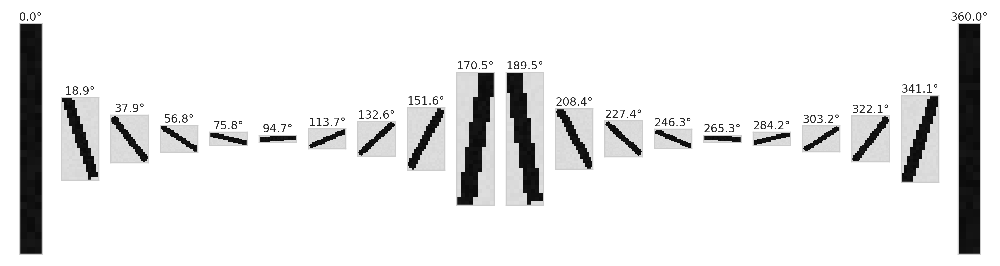
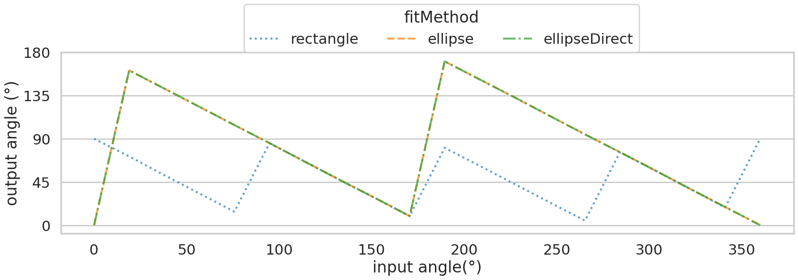
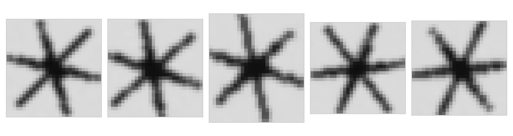
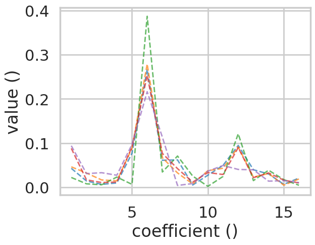

Variables
----------

======
Angles
======

The definition of the angles depends on the *fitMethod* dimension. This can be visualized by a simple model of a needle rotated by a defined input angle:

The output angles as they would be generated by **VISSSlib** with these inputs are plotted here:

It should be noted that, depending on the shape of a particle, elliptical fits in particular can lead to erroneous results.

====================
Fourier Coefficients
====================

The *contourFFT* variable contains the first 16 coefficients of the Fourier series of the particle contour. When normalized with the *contourFFTsum* 
variable, it contains valuable information about the particle geometry. 

A simple model of a dendrite is considered 5 times, each with a random degree of rotation:

Rotationally invariant behavior is revealed by plotting the normalized values of the *contourFFT* coefficients:

The clear maximum for the 6th coefficient shows that the a-frequency 6 is dominant for a dendrite, reflecting its rotational symmetry. Other examples 
for the are show in the notebook.